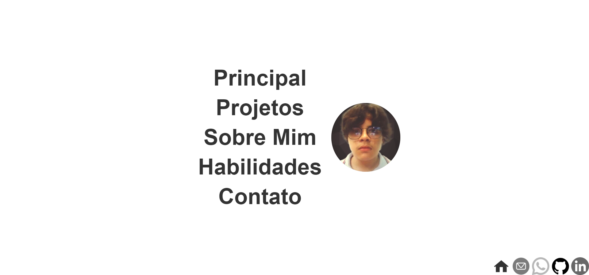

<h1>:😎: <a href="https://mateussrezendev.github.io/"> Portfólio </a></h1>

  
  
  

  

<h2>:bookmark_tabs: Descrição</h2>

Meu portfólio. Aplicação criada para mostrar os projetos que irei desenvolver durante minha carreira.

<h2>:hammer: Créditos</h2>
<table>
  <tr>
    <td align="center">
      <a href="https://github.com/mateussrezendev">
         
        
          <b>Mateus de Rezende santos</b>
        
      </a>
    </td>
  </tr>
</table>

<h2>:dollar: Licença</h2>
<b>Proibida a utilização dos arquivos para fins diferentes de aprendizado.</b>
